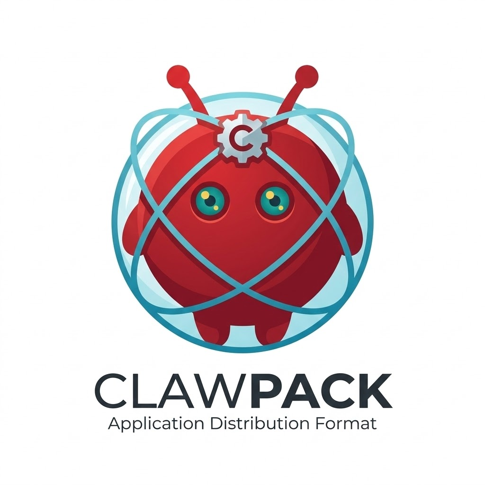

<p align="center">
  
</p>

<h1 align="center">HarnessHub</h1>

<p align="center">
  <a href="./README.md">English</a>
</p>

HarnessHub 是一个面向 Agent 运行环境的 harness image 打包标准。

当前实现仍通过 `harness` CLI 提供，并且最初从对 OpenClaw Agent 的**标准化导出、导入和验证**出发。它不是容器，也不是虚拟机，而是建立在这些基础设施之上的应用层打包系统。

## 产品方向

这个仓库最初从一个 OpenClaw 优先的打包 CLI 出发，但现在更清晰的产品方向已经形成：HarnessHub 正在演进为一个面向 Agent 运行环境的 harness image 打包标准，而 OpenClaw 是第一个生产级适配器。

当前产品定义见：

- `docs/prds/0002-product-foundation.md`
- `docs/prds/0003-roadmap-mvp-to-v1.md`
- `docs/architecture/0001-harness-image-architecture.md`

## 为什么需要 HarnessHub

一个 OpenClaw Agent 的可用状态不只是代码或配置，还包括：

```
┌─────────────────────────────────────────────────────┐
│              OpenClaw Agent 实例                      │
│                                                     │
│  ┌─────────────┐       ┌────────────────────────┐   │
│  │  工作区      │       │  模型提供商配置          │   │
│  │  AGENTS.md  │       │  API 密钥、模型偏好      │   │
│  │  SOUL.md    │       └────────────────────────┘   │
│  │  TOOLS.md   │                                    │
│  │  skills/    │       ┌────────────────────────┐   │
│  └─────────────┘       │  通道配置               │   │
│                        │  Telegram / Slack /     │   │
│  ┌─────────────┐       │  Discord               │   │
│  │  状态与记忆  │       └────────────────────────┘   │
│  │  会话历史    │                                    │
│  │  向量数据库  │       ┌────────────────────────┐   │
│  └─────────────┘       │  凭证与运行态信息        │   │
│                        └────────────────────────┘   │
└─────────────────────────────────────────────────────┘
```

Docker 能分发运行环境，但无法表达"哪些是模板、哪些是状态、哪些需要重新绑定"。HarnessHub 补上了这一层：

```
                 Docker                          HarnessHub
            ┌─────────────┐               ┌──────────────────┐
            │  OS + 依赖   │               │  模板 vs 状态 vs  │
            │  运行时      │               │  凭证            │
            │  二进制文件   │               │  ─────────────── │
            └─────────────┘               │  风险检测         │
                                          │  选择性导出       │
           分发的是                        └──────────────────┘
           "怎么运行"
                                          分发的是
                                          "Agent 是什么"
```

HarnessHub 已按当前 OpenClaw 目录模型处理 `agents/*`、`workspace-*` 以及配置里声明在 state dir 之外的 workspace。导入时会把 `openclaw.json` 里的 workspace 路径重绑到目标目录，避免多 agent 包迁移后仍指向旧机器路径。

## 安装

```bash
npm install -g harnesshub
```

要求 Node.js >= 20。

## 快速开始

四个命令构成一条线性工作流：

```
  机器 A                                              机器 B
 ┌────────────────────────────────────┐    ┌─────────────────────────────┐
 │                                    │    │                             │
 │  ① inspect ──▶ ② export           │    │  ③ import ──▶ ④ verify     │
 │     扫描          打包为            │    │     解包          验证      │
 │     & 报告        .clawpack  ──────┼───▶│     & 还原        结构完整性│
 │                                    │    │                             │
 └────────────────────────────────────┘    └─────────────────────────────┘
```

```bash
# 1. 识别当前 OpenClaw 实例
harness inspect

# 2. 导出为模板包（可安全分享）
harness export -t template -o my-agent.clawpack

# 3. 在另一台机器导入
harness import my-agent.clawpack -t ~/.openclaw

# 4. 验证导入结果
harness verify
```

## 命令

### `harness inspect`

扫描 OpenClaw 实例，报告其结构、敏感数据和推荐的导出类型。

```
 ~/.openclaw/
 ├── config/
 ├── workspace/         harness inspect
 ├── state/          ─────────────────────▶   报告：
 ├── .env                                     - 结构概览
 └── ...                                      - 发现的敏感数据
                                              - 推荐的包类型
```

```bash
harness inspect                  # 自动检测 ~/.openclaw
harness inspect -p /path/to/dir  # 指定路径
harness inspect -f json          # JSON 格式输出
```

### `harness export`

将实例导出为 `.clawpack` 包。

```
 ~/.openclaw/                                my-agent.clawpack
 ├── config/          harness export        (gzip 压缩的 tar)
 ├── workspace/    ─────────────────────▶    ┌──────────────┐
 ├── state/           -t template            │ manifest.json│
 ├── .env             -o my-agent.clawpack   │ config/      │
 └── ...                                     │ workspace/   │
                       ▲                     │ reports/     │
                       │                     └──────────────┘
                  敏感信息已排除
                  (template 模式)
```

```bash
harness export -t template       # 模板包（排除敏感信息）
harness export -t instance       # 实例包（完整迁移）
harness export -o out.clawpack   # 指定输出路径
harness export -p /path/to/dir   # 指定源路径
```

### `harness import`

将 `.clawpack` 包导入目标环境。

```
 my-agent.clawpack                          ~/.openclaw/
 ┌──────────────┐    harness import        ├── config/
 │ manifest.json│  ─────────────────────▶   ├── workspace/
 │ config/      │    -t ~/.openclaw         ├── state/
 │ workspace/   │                           └── ...
 │ state/       │
 └──────────────┘
```

```bash
harness import my-agent.clawpack              # 还原到 ~/.openclaw
harness import my-agent.clawpack -t ./target  # 指定目标目录
```

### `harness verify`

检查导入后的实例是否结构完整、基础可读。如果目标目录里存在持久化的导入 manifest，`verify` 还会附带执行 manifest 相关检查。

```
 ~/.openclaw/
 ├── config/  ✓        harness verify
 ├── workspace/  ✓   ─────────────────▶   所有检查通过  ✓
 ├── AGENTS.md  ✓                          - 目录存在
 └── state/  ✓                             - 工作区完整
                                           - manifest 检查（若导入 manifest 可用）
```

```bash
harness verify                  # 验证 ~/.openclaw
harness verify -p /path/to/dir  # 指定路径
```

## 包类型

```
                          .clawpack
                        ┌───────────┐
                        │           │
                ┌───────┴───┐ ┌────┴──────┐
                │ template  │ │ instance  │
                │ 模板包     │ │ 实例包     │
                └─────┬─────┘ └─────┬─────┘
                      │             │
          ┌───────────┴──┐  ┌──────┴───────────────┐
          │ 工作区        │  │ 工作区                │
          │ 安全配置      │  │ 全部配置               │
          │              │  │ 状态与会话             │
          │ ✗ 密钥       │  │ 凭证与 .env           │
          │ ✗ 会话       │  │                       │
          │ ✗ .env       │  │                       │
          └──────────────┘  └──────────────────────┘
                │                     │
          safe-share           trusted-migration-only
         (可公开分享)           (仅限受信任环境)
```

| 类型 | 用途 | 包含内容 | 风险等级 |
|------|------|----------|----------|
| **template** | 分享与复用 | 工作区、非敏感配置 | 面向分享；manifest 风险仍取决于源实例检测到的敏感信号 |
| **instance** | 完整迁移 | 配置、工作区、状态、凭证 | 当包含凭证或状态时通常为 `trusted-migration-only` |

模板包会自动排除凭证、会话数据、记忆数据库和 `.env` 文件，但 manifest 仍会记录源实例中检测到的敏感信号。

## 包格式

`.clawpack` 文件是一个 gzip 压缩的 tar 归档，包含以下结构：

```
my-agent.clawpack (gzip 压缩的 tar)
│
├── manifest.json ─── 包元数据
│                     ├── schema 版本
│                     ├── 包类型 (template / instance)
│                     └── 风险等级
│
├── config/ ───────── 配置文件
│
├── workspace/ ────── Agent 工作区
│                     ├── AGENTS.md
│                     ├── SOUL.md
│                     └── skills/
│
├── workspaces/ ───── 额外的按 agent 拆分工作区
│                     └── <agentId>/
│
├── state/ ────────── 会话与凭证数据
│                     (仅 instance 包)
│
└── reports/ ──────── 导出报告
```

## 风险等级

```
  safe-share              internal-only           trusted-migration-only
 ┌──────────────┐       ┌──────────────┐        ┌──────────────┐
 │  无敏感数据   │       │  非关键配置   │        │  包含凭证     │
 │  无状态数据   │       │              │        │  状态数据     │
 │              │       │              │        │  会话历史     │
 │  可安全分发   │       │  仅限团队内部 │        │  仅限受信任   │
 │              │       │  分享        │        │  环境导入     │
 └──────────────┘       └──────────────┘        └──────────────┘
    低风险 ◀──────────────────────────────────────▶ 高风险
```

| 等级 | 说明 |
|------|------|
| `safe-share` | 无敏感数据，可安全分发 |
| `internal-only` | 可能包含非关键配置，仅限团队内部分享 |
| `trusted-migration-only` | 包含凭证或状态数据，仅限受信任环境导入 |

风险等级来自导出 manifest 中记录的检测结果与敏感信号，并不只由 `template` / `instance` 类型本身决定。

## 输出格式

所有命令均支持 `-f text`（默认，人类可读）和 `-f json`（机器可读）两种输出格式。

```
 harness inspect -f text          harness inspect -f json
 ┌─────────────────────┐           ┌──────────────────────┐
 │  === 扫描报告 ===    │           │ {                    │
 │  路径: ~/.openclaw   │           │   "path": "~/.oc..", │
 │  文件: 42            │           │   "files": 42,       │
 │  风险: safe-share    │           │   "risk": "safe-sh.."│
 └─────────────────────┘           │ }                    │
    人类可读                        └──────────────────────┘
                                      机器可读
```

```bash
harness inspect -f json | jq '.riskAssessment'
```

## 开发

```bash
git clone https://github.com/HarnessHub/HarnessHub.git
cd HarnessHub
npm install
npm run build
npm test
```

### 项目结构

```
src/
├── cli.ts ─────────── 入口 (commander, 4 个命令)
├── commands/
│   ├── inspect.ts ─── 扫描与报告
│   ├── export.ts ──── 导出为 .clawpack
│   ├── import.ts ──── 从 .clawpack 导入
│   └── verify.ts ──── 结构验证
├── core/
│   ├── scanner.ts ─── 实例检测、敏感数据扫描
│   ├── packer.ts ──── 打包/解包逻辑、排除规则
│   ├── verifier.ts ── 完整性校验
│   └── types.ts ───── 共享类型与常量
└── utils/
    └── output.ts ──── 输出格式化 (text / json)
```

## 许可证

MIT
